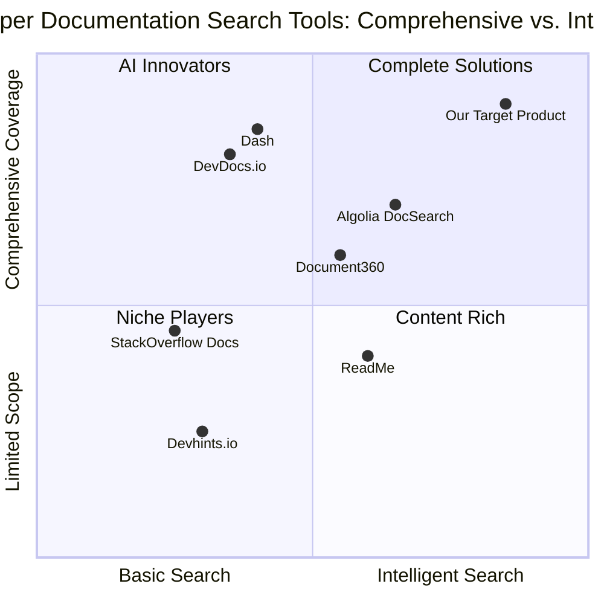

# Product Requirements Document

## DevRef – Documentation Search Companion

Prepared by: Emma, Product Manager
Date: May 26, 2025

## Table of Contents

1. [Introduction](#introduction)
2. [Product Definition](#product-definition)
3. [Market Analysis](#market-analysis)
4. [Technical Requirements](#technical-requirements)
5. [User Experience](#user-experience)
6. [Implementation Strategy](#implementation-strategy)
7. [Open Questions](#open-questions)

## Introduction

### Requirements Overview

Create a web application called "DevRef – Documentation Search Companion" that allows developers to search through technical documentation (MDN, React, Tailwind, etc.) using natural language queries. The application should leverage GPT and vector search to provide relevant documentation with live code previews. A key feature is the ability to ask questions like "How do I center a div in Tailwind?" and receive precise, contextually relevant documentation results.

### Project Scope

The initial version will focus on web development documentation sources including MDN Web Docs, React documentation, and Tailwind CSS documentation. The application will be built using React, JavaScript, and Tailwind CSS.


## Product Definition

### Product Goals

1. **Unified Developer Reference Engine**: Create a single, intuitive platform that consolidates technical documentation from multiple sources, eliminating the need to navigate separate documentation sites.

2. **Natural Language Understanding**: Enable developers to search using conversational queries rather than exact keywords, bridging the gap between how developers think and how documentation is structured.

3. **Interactive Learning Environment**: Provide not just static documentation but an interactive environment with live code previews to accelerate understanding and implementation.

### User Stories

1. **As a junior developer**, I want to ask questions about technical concepts in plain English so that I can find documentation even when I don't know the exact terminology.

2. **As a full-stack developer**, I want to search across multiple documentation sources simultaneously so that I can quickly find cross-technology solutions without switching contexts.

3. **As a front-end developer**, I want to see live previews of UI code examples so that I can understand the visual impact of implementation choices before writing code.

4. **As a developer learning a new framework**, I want to compare similar functionality across different libraries so that I can make informed decisions about implementation approaches.

5. **As a team lead**, I want to save and share documentation references with contextual notes so that I can help my team consistently implement best practices.

### Competitive Analysis

| Product | Strengths | Weaknesses |
|---------|-----------|------------|
| **Algolia DocSearch** | - Fast, keyword-based search<br>- Wide adoption across many documentation sites<br>- Clean integration | - Limited to keyword matching<br>- No integrated code previews<br>- Separate implementation for each doc site |
| **Document360** | - Comprehensive knowledge base<br>- Version control<br>- Strong analytics | - Primarily for creating docs, not searching external sources<br>- Higher price point<br>- Limited natural language understanding |
| **Dash by Kapeli** | - Offline documentation<br>- Multiple doc sets<br>- Fast performance | - Desktop only<br>- Traditional search approach<br>- Limited interactive features |
| **Devhints.io** | - Focused cheatsheets<br>- Clean, minimal UI<br>- Community contributions | - Limited depth of content<br>- Basic search functionality<br>- No natural language processing |
| **ReadMe** | - Interactive API guides<br>- Customizable appearance<br>- Developer-friendly features | - Focused on API docs only<br>- Expensive for growing teams<br>- Limited to owned documentation |
| **DevDocs.io** | - Unified interface for many docs<br>- Offline support<br>- Open source | - Basic search functionality<br>- Limited context understanding<br>- No live code previews |
| **StackOverflow Documentation** | - Community-driven content<br>- Example-focused approach<br>- Integrated with Q&A | - Discontinued service<br>- Inconsistent coverage<br>- No semantic search |

### Competitive Quadrant Chart



## Market Analysis

### Market Need

The developer documentation space is experiencing significant challenges that DevRef can address:

1. **Documentation Fragmentation**: Developers must navigate multiple documentation sites with different structures, search capabilities, and UX patterns.

2. **Knowledge Discovery Gap**: Traditional keyword search fails to bridge the gap between a developer's question and the technical terminology used in documentation.

3. **Context Switching Cost**: Moving between different documentation sources disrupts workflow and reduces productivity.

4. **Implementation Friction**: Static code examples require mental translation to the developer's specific use case, slowing down implementation.

5. **Documentation Search Limitations**: Existing search tools primarily focus on keyword matching rather than understanding the intent behind developer queries.

According to the Stack Overflow 2023 Developer Survey, developers spend approximately 30% of their time searching for information or solutions to problems. A tool that can reduce this time even by a small percentage would provide significant value to the developer community.

### Target Audience

1. **Professional Web Developers**: Need quick, accurate answers to implementation questions across multiple technologies.

2. **Junior Developers & Students**: Benefit from natural language queries when they don't know exact terminology.

3. **Technical Teams**: Need shared, consistent documentation references across projects and team members.

4. **Developer Advocates & Educators**: Require up-to-date, accurate documentation references for teaching and content creation.

5. **Open Source Contributors**: Need to quickly understand documentation patterns across projects they contribute to.

### Market Size & Growth

The developer tools market was valued at approximately $22.2 billion in 2023 and is expected to grow at a CAGR of 15.2% from 2024 to 2030. Developer productivity tools specifically represent about 18% of this market.

The rise of AI-assisted development tools indicates a growing demand for intelligent assistance in the development workflow, with investment in AI developer tools growing by over 230% between 2022 and 2024.

## Technical Requirements

### Requirements Analysis

To build an effective documentation search companion with natural language processing capabilities, we need to address several key technical requirements:

1. **Documentation Data Integration**: Ability to access, index, and update content from multiple documentation sources including MDN, React, Tailwind CSS, and the ability to easily add new sources.

2. **Natural Language Processing**: Implementation of an advanced query understanding system that can interpret developer questions and intent beyond simple keyword matching.

3. **Vector Search Implementation**: Creation of vector embeddings for documentation content to enable semantic search capabilities.

4. **Live Code Preview Engine**: A system to render and display interactive code examples directly in search results.

5. **User State Management**: Functionality to save searches, create collections of references, and personalize the experience.

6. **Cross-Browser Compatibility**: Ensuring consistent functionality across modern browsers used by developers.

7. **Mobile Responsiveness**: Creating an experience that works well on various devices and screen sizes.

### Requirements Pool

#### P0 (Must-Have Features)

1. **Natural Language Search**
   - MUST support conversational queries like "How do I center a div in Tailwind?"
   - MUST return contextually relevant documentation results
   - MUST include source attribution for all retrieved content

2. **Multi-Source Documentation Integration**
   - MUST index and search content from MDN, React, and Tailwind documentation
   - MUST clearly indicate which documentation source each result comes from
   - MUST maintain up-to-date documentation data

3. **Live Code Preview**
   - MUST render HTML, CSS, and JavaScript examples in real-time
   - MUST allow basic interaction with rendered examples
   - MUST properly format code snippets with syntax highlighting

4. **Result Relevance**
   - MUST rank results based on semantic relevance to the query
   - MUST display the most pertinent section of documentation
   - MUST support filtering results by technology/framework

#### P1 (Should-Have Features)

1. **User Accounts**
   - SHOULD provide user registration and authentication
   - SHOULD allow saving favorite searches and documentation references
   - SHOULD enable sharing saved references with team members

2. **Advanced Filtering**
   - SHOULD support filtering by version numbers of frameworks/libraries
   - SHOULD allow filtering by result type (function reference, tutorial, etc.)
   - SHOULD provide advanced search operators for power users

3. **Code Playground**
   - SHOULD allow users to modify example code and see results in real-time
   - SHOULD support importing dependencies in code examples
   - SHOULD provide basic error highlighting in code examples

4. **Customizable Interface**
   - SHOULD support both light and dark themes
   - SHOULD allow adjustable result display density
   - SHOULD enable keyboard shortcuts for common actions

5. **Performance Optimization**
   - SHOULD provide fast search results (under 1 second for typical queries)
   - SHOULD implement efficient caching of common searches
   - SHOULD support offline access to previously viewed documentation

#### P2 (Nice-to-Have Features)

1. **Extended Documentation Sources**
   - MAY include documentation from Vue, Angular, Next.js, and other popular frameworks
   - MAY integrate with language-specific documentation (Python, Ruby, etc.)
   - MAY support custom documentation source addition

2. **AI-Generated Explanations**
   - MAY provide simplified explanations of complex concepts
   - MAY offer code conversion examples between frameworks
   - MAY generate additional usage examples based on documentation

3. **Community Features**
   - MAY allow community voting on most helpful documentation examples
   - MAY support community-contributed examples and notes
   - MAY enable discussions around specific documentation elements

4. **Integration with Development Tools**
   - MAY provide VS Code extension for in-editor documentation access
   - MAY offer browser extension for context-based documentation suggestions
   - MAY support integration with GitHub Copilot or similar tools

5. **Analytics Dashboard**
   - MAY track most-searched topics for team administrators
   - MAY provide insights on documentation usage patterns
   - MAY suggest learning resources based on search history

### UI Design Draft

```
+-------------------------------------------------------+
|  DevRef                    [Search Bar]      [User]    |
+-------------------------------------------------------+
|                                                       |
|  How do I center a div in Tailwind?    [Search]       |
|                                                       |
|  [ ] MDN  [ ] React  [X] Tailwind  [ ] All            |
|                                                       |
|  +---------------------------------------------------+|
|  | Result #1: Tailwind CSS Documentation             ||
|  |                                                   ||
|  | To center a div in Tailwind, use the flex         ||
|  | utility classes:                                  ||
|  |                                                   ||
|  | ```html                                           ||
|  | <div class="flex justify-center items-center">    ||
|  |   <div>Centered content</div>                    ||
|  | </div>                                            ||
|  | ```                                               ||
|  |                                                   ||
|  | [Live Preview]                                    ||
|  |  +-----------------------------------+            ||
|  |  |                                   |            ||
|  |  |          Centered content         |            ||
|  |  |                                   |            ||
|  |  +-----------------------------------+            ||
|  |                                                   ||
|  | [View Original]  [Save]  [Share]                  ||
|  +---------------------------------------------------+|
|                                                       |
|  +---------------------------------------------------+|
|  | Result #2: Tailwind CSS - Centering Elements      ||
|  | ...                                               ||
+-------------------------------------------------------+
```

## User Experience

### Core User Journey

1. **Search Initiation**
   - User arrives at DevRef with a specific development question
   - User enters a natural language query in the search bar (e.g., "How do I create a responsive grid in React?")
   - Optional: User applies pre-search filters to target specific documentation sources

2. **Results Exploration**
   - System displays ranked search results with relevant documentation sections
   - Each result includes:
     - Documentation source and section
     - Key code snippets with syntax highlighting
     - Live preview (when applicable)
     - Options to save, share, or view original documentation

3. **Interactive Engagement**
   - User interacts with code examples in the live preview
   - User can modify code to test variations
   - System updates preview in real-time

4. **Knowledge Retention**
   - User saves useful documentation references to their personal collection
   - User organizes saved references by project or topic
   - User can add personal notes to saved references

### UI/UX Considerations

1. **Minimalist Interface**
   - Clean, distraction-free design prioritizing content and code readability
   - Typography optimized for technical content with appropriate contrast
   - Subtle animations to enhance the experience without being distracting

2. **Technical User Optimization**
   - Keyboard shortcuts for all common actions
   - Markdown support in search queries for technical specifications
   - Copy code button on all code snippets

3. **Search Experience Enhancement**
   - Autocomplete suggestions based on common developer queries
   - Instant search results that update as the user types
   - Advanced filtering options accessible through intuitive UI

4. **Visual Design Elements**
   - Color scheme based on modern IDE themes (light and dark options)
   - Custom iconography for different documentation sources and content types
   - Consistent visual hierarchy to guide users through search results

5. **Accessibility**
   - Full keyboard navigation support
   - Screen reader compatibility for all features
   - Customizable text sizes and contrast options


## Implementation Strategy

### Technology Stack

1. **Front-End**
   - Framework: React
   - Styling: Tailwind CSS
   - State Management: React Context API + local storage
   - Code Editor: Monaco Editor or CodeMirror
   - Live Preview: Sandpack or similar component

2. **Back-End**
   - API Framework: Node.js with Express
   - Authentication: Auth0 or Firebase Authentication
   - Database: MongoDB for user data, Vector database (Pinecone or similar) for embeddings

3. **AI and Search**
   - Language Model: OpenAI GPT-4 or equivalent for query understanding
   - Embeddings: OpenAI Embeddings API for vector creation
   - Vector Search: Pinecone, Weaviate, or similar for semantic search
   - Hybrid Search: Combination of vector and keyword search for optimal results

4. **Documentation Processing**
   - Content Extraction: Custom scrapers and parsers for each documentation source
   - Preprocessing: Markdown parsing and section segmentation
   - Embedding Generation: Batch processing for vector creation
   - Update Mechanism: Regular scheduled updates to maintain current documentation

### Development Phases

#### Phase 1: MVP (8 weeks)

1. **Weeks 1-2: Research and Architecture**
   - Documentation source analysis
   - Vector search implementation research
   - System architecture design

2. **Weeks 3-4: Core Search Functionality**
   - Documentation data extraction and processing
   - Basic search API implementation
   - Initial front-end interface development

3. **Weeks 5-6: Natural Language Processing Integration**
   - Query understanding system implementation
   - Vector embedding generation
   - Results ranking algorithm development

4. **Weeks 7-8: Live Preview and Testing**
   - Code preview component implementation
   - Basic interactivity features
   - User testing and feedback collection

#### Phase 2: Enhanced Features (6 weeks)

1. **Weeks 1-2: User Management System**
   - User registration and authentication
   - Saved searches and references
   - User preferences

2. **Weeks 3-4: Advanced Search Capabilities**
   - Advanced filtering options
   - Cross-documentation search improvements
   - Context-aware search results

3. **Weeks 5-6: Interactive Code Environment**
   - Enhanced code playground functionality
   - Dependency management for examples
   - Result sharing capabilities

#### Phase 3: Expansion and Optimization (Ongoing)

1. **Additional Documentation Sources**
   - Integration of more framework and library documentation
   - Language-specific documentation sources
   - API documentation integration

2. **Performance Optimization**
   - Caching strategy implementation
   - Search speed optimization
   - Mobile experience enhancements

3. **Community Features**
   - User contributions and notes
   - Voting and ranking system
   - Custom collections and sharing

### Success Metrics

1. **User Engagement**
   - Average search session duration
   - Searches per user per week
   - Return user rate

2. **Search Effectiveness**
   - Click-through rate on search results
   - Time to first relevant result
   - Query refinement frequency

3. **Feature Adoption**
   - Live preview interaction rate
   - Code modification frequency
   - Save and share actions

4. **Business Metrics**
   - User acquisition cost
   - Monthly active users growth
   - Premium feature conversion rate (if applicable)

## Open Questions

1. **Documentation Access and Copyright**
   - What are the legal implications of indexing and displaying content from various documentation sources?
   - Should we pursue formal partnerships with documentation providers?
   - How do we handle attribution and linking to original sources?

2. **Vector Search Optimization**
   - What is the optimal chunking strategy for documentation content?
   - How frequently should embeddings be updated as documentation changes?
   - What is the best approach for handling code snippets in the vector space?

3. **User Personalization**
   - How much personalization should be based on explicit user preferences versus implicitly learned patterns?
   - Should search results vary based on a user's technology stack or experience level?
   - How can we balance personalization with discovery of new resources?

4. **Monetization Strategy**
   - Should the product follow a freemium model with premium features?
   - What enterprise features could be developed for team licenses?
   - Are there partnership opportunities with documentation providers or educational platforms?

5. **Expansion Strategy**
   - Which documentation sources should be prioritized after the initial set?
   - Should we eventually support non-web development documentation?
   - Is there value in creating an API for third-party integrations?

## Conclusion

DevRef – Documentation Search Companion addresses a critical need in the developer workflow by creating a unified, intelligent interface for technical documentation. By leveraging natural language processing and vector search technology, it bridges the gap between how developers think about problems and how documentation is structured.

The combination of semantic search capabilities with interactive code previews creates a uniquely valuable tool that not only helps developers find information but also accelerates their implementation process. With proper execution, DevRef has the potential to become an essential part of the modern development workflow.

By starting with the most commonly used web development documentation sources and expanding based on user feedback, we can create a product that delivers immediate value while establishing a foundation for future growth. The technical approach outlined in this document balances innovation with practicality, ensuring we can deliver a high-quality product within reasonable time constraints.

This product has the potential to significantly reduce the time developers spend searching for documentation and implementation examples, directly contributing to improved development efficiency and quality across the industry.
