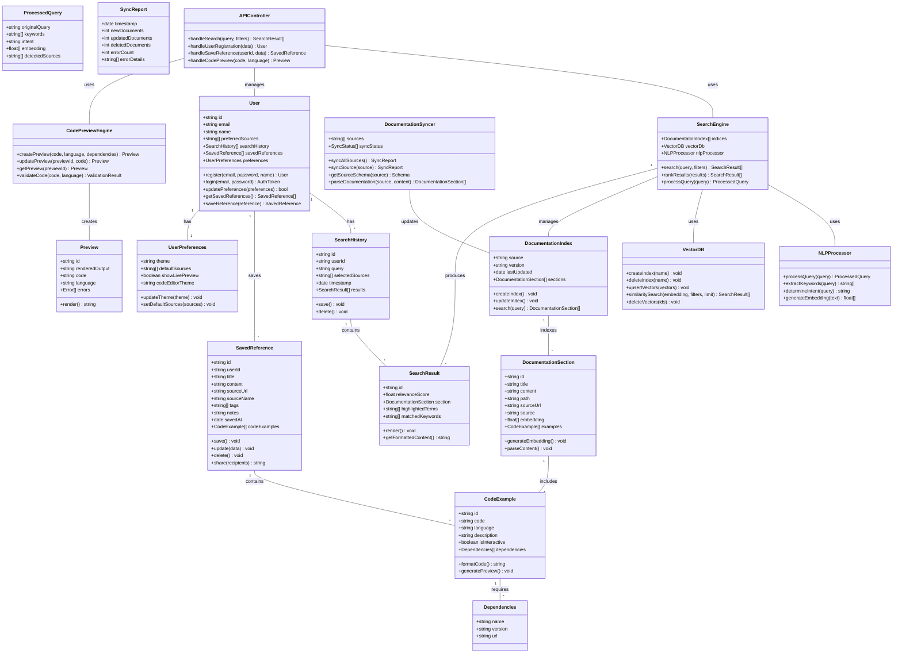
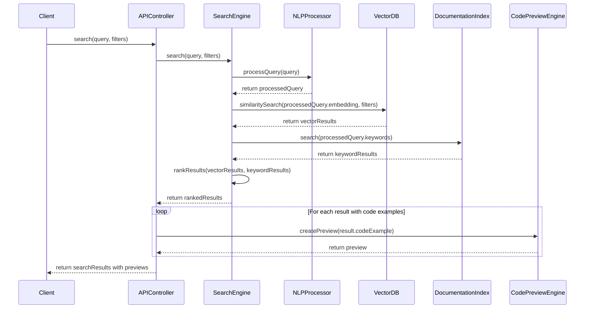
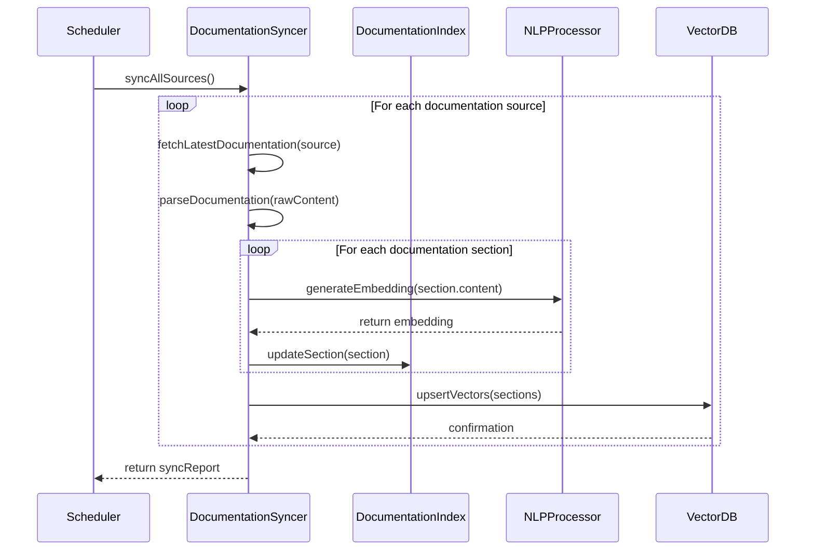
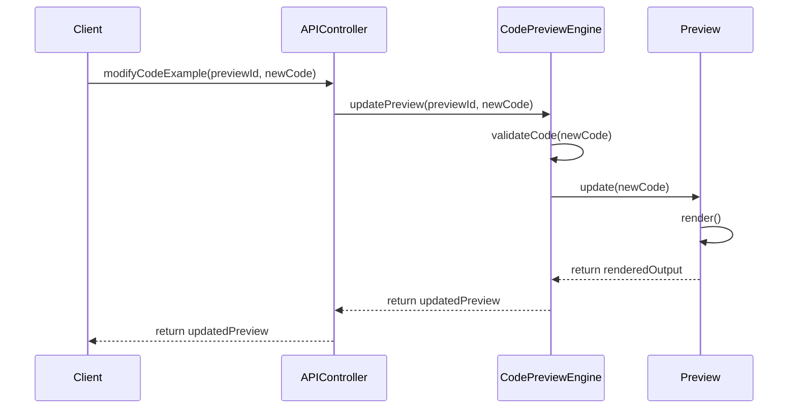
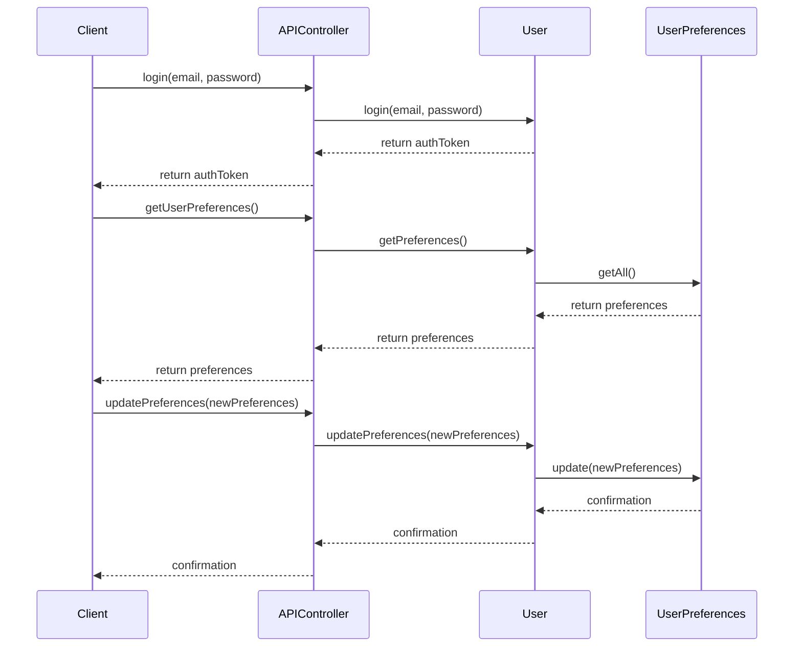
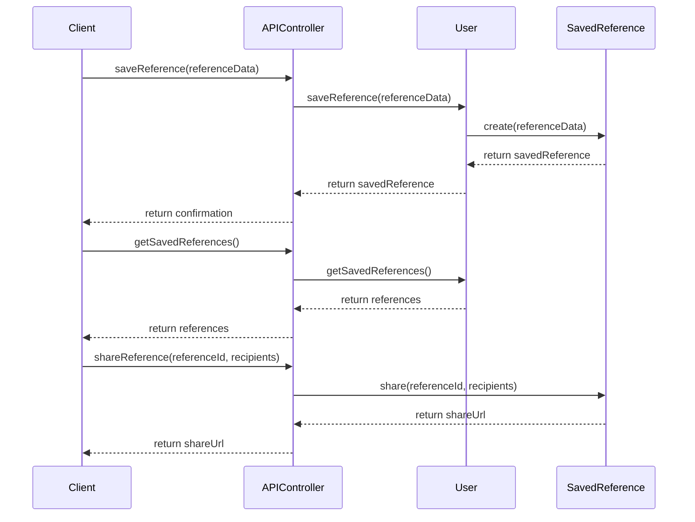

# DevRef - Documentation Search Companion: System Design

## Implementation approach

Based on the PRD, we need to build a unified documentation search platform that leverages natural language processing and vector search to provide relevant answers to developer queries across multiple documentation sources. The system needs to include live code previews with interactive examples.

### Key Technical Challenges

1. **Documentation Indexing and Processing**:
   - Creating efficient crawlers and parsers for different documentation sources
   - Implementing a consistent processing pipeline for different documentation formats
   - Maintaining up-to-date documentation with regular synchronization

2. **Vector Search Implementation**:
   - Optimizing content chunking for effective vector embeddings
   - Creating and maintaining vector indexes for semantic search
   - Balancing vector search with keyword search for optimal results

3. **Natural Language Query Processing**:
   - Interpreting developer intent from conversational queries
   - Matching queries to the most relevant documentation sections
   - Supporting technical terminology and code-related questions

4. **Live Code Preview**:
   - Creating a secure sandboxed environment for code execution
   - Supporting multiple frameworks and libraries in previews
   - Enabling real-time code editing and preview updates

### Technical Stack Selection

1. **Frontend**:
   - **React**: For building the user interface with component-based architecture
   - **Tailwind CSS**: For rapid UI development with utility-first approach
   - **CodeMirror**: For code editing capabilities with syntax highlighting
   - **Sandpack**: For live code previews in a sandboxed environment

2. **Backend**:
   - **Node.js with Express**: For API development and server-side operations
   - **MongoDB**: For storing user data, saved searches, and metadata
   - **Pinecone**: As vector database for storing and searching embeddings

3. **AI and Search**:
   - **OpenAI API**: For query understanding and generating embeddings
   - **Hybrid Search System**: Combining vector search with keyword-based search

4. **DevOps**:
   - **Docker**: For containerization and consistent deployment
   - **GitHub Actions**: For CI/CD pipelines
   - **AWS/Vercel**: For hosting and scaling

### Open Source Libraries

1. **Vector Search & Embeddings**:
   - **LangChain**: For building NLP pipelines and handling embeddings
   - **sentence-transformers**: Alternative for generating embeddings locally

2. **Documentation Processing**:
   - **Cheerio**: For HTML parsing when scraping documentation
   - **unified.js**: For processing Markdown documentation
   - **remark**: For markdown processing and AST manipulation

3. **Code Execution & Preview**:
   - **Sandpack**: For creating interactive code environments
   - **ESBuild**: For fast bundling of JavaScript code
   - **PostCSS**: For processing CSS in the live preview

4. **Search & Caching**:
   - **Meilisearch**: For additional text search capabilities
   - **Redis**: For caching frequent queries and results

## Data structures and interfaces

The system will be built using the following key data structures and interfaces:

## Program call flow

The following sequence diagrams illustrate the key program flows in the DevRef system:

### 1. Search Query Processing Flow

### 2. Documentation Synchronization Flow

### 3. User Interaction with Code Examples Flow

### 4. User Authentication and Preference Management Flow

### 5. Saving and Managing References Flow

## Anything UNCLEAR

1. **Documentation Source Access Rights:**
   The PRD doesn't specify how we'll access the documentation sources (MDN, React, Tailwind, etc.). We'll need to determine if we should:
   - Use official APIs if available
   - Implement web scraping with proper rate limiting and attribution
   - Establish formal partnerships with documentation providers

2. **Vector Chunking Strategy:**
   The optimal chunking strategy for documentation content needs investigation. Different strategies might work better for different documentation types (API references vs. tutorials vs. guides).

3. **Real-time Code Preview Security:**
   The security model for executing user-modified code in previews needs further definition. We need to establish clear boundaries for code execution to prevent security issues.

4. **Scalability of Vector Search:**
   As documentation sources increase, the vector database will grow significantly. We need to define a strategy for scaling the vector search capability efficiently.

5. **Caching Strategy:**
   The PRD mentions efficient caching but doesn't specify the approach. We need to define what gets cached (queries, results, embeddings) and for how long.

6. **Authentication Requirements:**
   While user authentication is listed as a P1 feature, we need more specific requirements about the authentication methods (email/password, OAuth, etc.) and security requirements.
